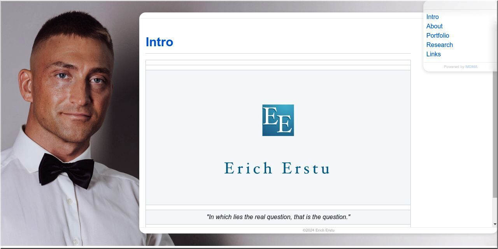

# About ########################################################################

In this context MDMA stands for "MarkDown Monolith Assembler". It is a command
line tool for building elegant browser-based books using the Markdown markup
language.

When given a markdown document as an input, this program produces a monolithic
JavaScript-free HTML5 application as an output. For example, from this very
_readme_ file an HTML document would be generated that renders as shown in the
below screenshot.

|                     [![Screenshot][img-demo]][url-demo]                      |
| :--------------------------------------------------------------------------: |
|  Screenshot depicting how this document renders in the Chromium web browser  |

[img-demo]: screenshot.jpg
[url-demo]: https://raw.githack.com/1Hyena/mdma/master/framework.html
            "Click to see this document in your web browser"

To see a live demo of this document in the format of an HTML application, click
on the above screenshot and the respective page will open in your web browser.


# Usage ########################################################################

MDMA makes use of the standard input, output and error streams and follows the
_garbage in, garbage out_ (GIGO) principle by design. If the program is started
with the `-h` (short for `--help`) argument, then it will only print its usage
synopsis and exit.

In the following sections the usage synopsis is given, followed by the most
common build instructions. Finally, libraries that need to be installed on the
host system for successful compilation are listed.


## Synopsis ####################################################################

```
Usage: mdma [OPTION]... [FILE]
General options:
      --brief         Print brief messages (default).
      --debug         Print debugging messages.
  -f  --framework     Use a custom HTML framework file.
  -h  --help          Display this usage information.
      --minify        Disable HTML indentation and wrapping.
  -o  --output        Specify output file (default: stdout).
      --verbose       Print verbose messages.
  -v  --version       Show version information.

Markdown dialect options:
      --commonmark    Use the CommonMark syntax.
      --github        Use Github flavored markdown (default).

```

If the _FILE_ argument is missing, the program will attempt to read a markdown
document from its standard input.


## Build Instructions ##########################################################

MDMA is written in C++ and should be trivial to compile on most Linux based
systems. Just go to the _src_ directory and type _make_. If compilation fails,
then most likely you are missing some of the required dependencies listed in the
following section.


## Dependencies ################################################################

In order to compile this program from its _Makefile_, the following libraries
and their respective header files must be present in the system.

* [md4c](https://github.com/mity/md4c) —
  C Markdown parser

* [tinyxml2](https://github.com/leethomason/tinyxml2) —
  Simple XML parser made for easy integration

* [tidy](https://www.html-tidy.org/) —
  A tool to tidy down HTML code to a clean style


# Showcase #####################################################################

Next, some of the projects that have put MarkDown Monolith Assembler into a good
use are listed.

|                                    |
| :--------------------------------------------------------------------------: |
|                  [ErichErstu.net](https://ErichErstu.net/)                   |


# License ######################################################################

MarkDown Monolith Assembler has been authored by Erich Erstu and is released
under the [MIT](LICENSE) license.
